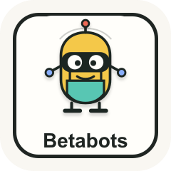

# Betabots

<p align="center">
  
</p>

Betabots is a plugin and skill bundle for filling a product with truthful synthetic beta users: human-like personas with defined pasts, life goals, attention spans, emotions, and real preferences that do not default to fake politeness.

**Links**

- [Landing page](https://betabots.rachkovan.com)
- [Live dashboard demo](https://betabots-dashboard.rachkovan.com)
- [Repository](https://github.com/yevgeniusr/betabots)

<p align="center">
  
</p>

It is inspired by the multi-harness plugin layout of [Superpowers](https://github.com/obra/superpowers): one repository ships skills, references, scripts, and manifests for multiple coding-agent runtimes.

## Status

Betabots is free and open-source software under the [GNU Affero General Public License v3.0 or later](LICENSE).

AGPLv3 allows personal and commercial use, copying, modification, and redistribution. If someone distributes a modified version or runs a modified version as a network service for others, they must provide the corresponding source code under the same license.

## Quick Start

```bash
git clone https://github.com/yevgeniusr/betabots.git
cd betabots
tests/smoke.sh
scripts/install-local.sh all
```

Then start a new agent thread and ask it to use Betabots against a local or staging app.

## Documentation

- [Contributing](CONTRIBUTING.md): development workflow, contribution rules, and review expectations.
- [Security](SECURITY.md): how to report vulnerabilities or unsafe automation behavior.
- [Code of Conduct](CODE_OF_CONDUCT.md): community behavior expectations.
- [Local dashboard](docs/dashboard.md): read-only web UI for `.betabots/runs` artifacts.
- [License guide](docs/license.md): plain-English summary of the AGPLv3 terms.
- [Logo](docs/logo-concepts.md): selected Betabots identity and asset paths.
- [Usage guide](docs/usage.md): practical setup and run flow for browser Betabots.
- [Truthful personalities](docs/truthful-personalities.md): the core Betabots model for non-performative synthetic users.

## What Betabots Do

A betabot is not QA. It does not know code and does not know it is testing. It is a simulated person who discovers your product, tries to understand it, uses it, waits, returns, interacts with other simulated people, and may leave for normal human reasons.

The main advantage of Betabots is truthful personality pressure. A useful betabot should say what it actually thinks from its assigned life context, even when that means boredom, distrust, dislike, uncertainty, social rejection, or “this is not worth my time.” It should not behave like a generic agreeable AI assistant trying to be nice to the builder.

Betabots can help you answer:

- Do new users understand the product?
- Does the product feel alive without real users yet?
- Do social, dating, marketplace, chat, or booking flows work across multiple sessions?
- Where do users get bored, scared, confused, or convinced?
- Which changes make users happier enough to return?
- Which users would honestly reject the product, and why?

## Browser Betabots

Betabots launches real browsers and runs human-speed sessions. It is for comprehension, trust, emotion, copy, onboarding, visual UI, and product taste. Each bot repeatedly captures its current screen, inventories visible controls, thinks with its persona LLM, chooses one action, executes it, and observes the result. It records what it sees, thinks, clicks, types, misunderstands, likes, and why it leaves or returns.

Betabots must interact through the same visible product surface a person can see. The runner does not call product APIs, use server URLs, load hidden implementation maps, or ship project-specific lifecycle code.

```bash
BETABOT_COHORT_FILE=skills/betabots/examples/generic-saas.cohort.json \
BETABOT_APP_URL=http://localhost:5173 \
BETABOT_THOUGHTFUL_COUNT=5 \
BETABOT_THOUGHTFUL_MINUTES=8 \
BETABOT_HEADLESS=false \
node skills/betabots/scripts/thoughtful_browser_betabots.cjs
```

Browser sessions use real-time pacing (`BETABOT_TIME_SCALE=1`). Thoughtful mode clamps lower values back to `1`.

Betabots use an actual multimodal LLM mind layer continuously during browser use. Screenshots and visible-control IDs are sent with each decision so the model chooses the next action instead of merely narrating one:

- `BETABOT_LLM_PROVIDER=codex` uses local Codex CLI with the signed-in ChatGPT/Codex account.
- `BETABOT_LLM_PROVIDER=openrouter` uses OpenRouter chat completions.
- `BETABOT_LLM_PROVIDER=none` is rejected because a run without a mind is not a Betabot run.

```bash
BETABOT_LLM_PROVIDER=codex \
BETABOT_LLM_MODEL=gpt-5 \
node skills/betabots/scripts/thoughtful_browser_betabots.cjs
```

For OpenRouter:

```bash
BETABOT_LLM_PROVIDER=openrouter \
BETABOT_LLM_MODEL=openai/gpt-4.1-mini \
OPENROUTER_API_KEY=... \
node skills/betabots/scripts/thoughtful_browser_betabots.cjs
```

For mock-backed UI smoke tests, synthetic local-storage auth is still available:

```bash
BETABOT_AUTH_LOCAL_STORAGE_KEY=your.auth.storage.key \
BETABOT_AUTH_TOKEN_TEMPLATE='dev-token:{id}' \
node skills/betabots/scripts/thoughtful_browser_betabots.cjs
```

`{id}`, `{name}`, and `{role}` are replaced per bot so sessions do not accidentally share user state.
Because this bypasses the product's authentication flow, Betabots marks the
environment invalid and caps scores at `0`. Never use injected auth for a report
that claims a working product.

For a real-backend run, create Playwright storage state through the product's
actual login UI and require a runtime attestation:

```bash
BETABOT_REQUIRE_REAL_BACKEND=true \
BETABOT_ENVIRONMENT_ATTESTATION_URL=http://localhost:8080/health/integrity \
BETABOT_STORAGE_STATE_TEMPLATE='/tmp/product-auth/{id}.json' \
node skills/betabots/scripts/thoughtful_browser_betabots.cjs
```

The attestation must report real authentication and connected, persistent
PostgreSQL storage. Missing or failed attestations, injected auth, explicit mock
headers, mock/fixture modes, volatile storage, and missing storage-state files
invalidate the run and force every happiness score to `0`.

For social products, enable **Betabook** and **Destiny** as separate layers.

Betabook is a simple Reddit-like board scoped to the current simulation. Betabots can introduce themselves, post coordination or help notes, comment, receive invites, and coordinate outside the product UI while still behaving like independent people.

Destiny is the orchestration layer. It watches the cohort in real time, follows a global master plan, and makes paths cross, almost cross, or intentionally not cross. Destiny can manipulate Betabook and can nudge individual betabots by giving them believable hunches, timing, and actions.

```bash
BETABOT_BETABOOK=true \
BETABOT_DESTINY=true \
BETABOT_AUTH_LOCAL_STORAGE_KEY=your.auth.storage.key \
BETABOT_AUTH_TOKEN_TEMPLATE='dev-token:{id}' \
node skills/betabots/scripts/thoughtful_browser_betabots.cjs
```

Betabook writes `betabook.json`. Destiny writes `destiny.json`. The raw bot stories record Betabook moments and Destiny nudges separately.

For long-form research, set explicit minimum and maximum session lengths:

```bash
BETABOT_THOUGHTFUL_COUNT=50 \
BETABOT_THOUGHTFUL_MINUTES=60 \
BETABOT_THOUGHTFUL_MIN_SESSION_MINUTES=60 \
BETABOT_THOUGHTFUL_MAX_SESSION_MINUTES=75 \
BETABOT_THOUGHTFUL_CONCURRENCY=10 \
node skills/betabots/scripts/thoughtful_browser_betabots.cjs
```

The runner aggregates first-person thoughts and ideas into `analysis.md` and `summary.json`.
Thoughtful sessions use a screenshot -> think -> validated action loop. Route configuration gives the mind optional journey hints; it does not script browser movement. A failed LLM action decision is recorded as a mind failure and cannot silently fall back to deterministic navigation.
By default, Betabots uses a generic cross-product cohort. For domain-specific testing, pass `BETABOT_COHORT_FILE` with roles, pasts, discovery circumstances, routes, value keywords, trust keywords, and idea rules. See `skills/betabots/references/cohort-config.md`.

Truth pressure is always on. Bots treat honesty, attention, and money as scarce survival constraints, and you can tune the ledger costs for a run:

```bash
BETABOT_TRUTH_YEARS=100 \
BETABOT_TRUTH_ACTION_MONTHS=1 \
BETABOT_APP_URL=http://localhost:5173 \
node skills/betabots/scripts/thoughtful_browser_betabots.cjs
```

Each bot gets a seeded life goal, recorded website actions cost life, committed dollars cost life, and the LLM prompt requires direct private judgments instead of flattering or socially convenient answers. The runner records the life ledger and truth assessments in raw session files, `summary.json`, and `analysis.md`.

Truth pressure is an honesty mechanism, not a magic oracle. The current implementation verifies that bots produce direct private assessments and life-cost justifications; benchmark runs should still inspect whether those assessments are concrete, role-grounded, and willing to be negative.

## Repository Layout

```text
.codex-plugin/plugin.json      Codex plugin manifest
.claude-plugin/plugin.json     Claude Code plugin manifest
.cursor-plugin/plugin.json     Cursor plugin manifest
assets/                        Banner and icon assets
docs/                          Usage and license documentation
web/                           Optional local dashboard for .betabots/runs
skills/betabots/SKILL.md       Main Betabots skill
skills/betabots/scripts/       Cohort, analysis, and browser-run scripts
skills/betabots/examples/      Reusable generic cohort files
skills/betabots/references/    Session templates, safety, cohort, and browser guidance
scripts/install-local.sh       Local installer for Codex, Claude, and Cursor
tests/smoke.sh                 Lightweight validation
```

## Plugin And Runtime

Betabots is already packaged as a Codex, Claude Code, Cursor, and Agent Skills plugin. The plugin is the discovery and instruction layer; the bundled Node process is the portable runtime used by those hosts. It owns Playwright browser contexts, human-paced timers, concurrent bot isolation, screenshot files, evidence logs, and deterministic cleanup.

Keeping that runtime out of the host agent prevents one long Codex or Claude conversation from becoming the browser scheduler for every bot. It also makes the same cohort behavior available across hosts. Node is an implementation choice, not a product boundary: another runtime could implement the same screenshot -> decision -> action protocol, but a plugin alone still needs executable code somewhere to keep browsers alive and coordinate them.

## Install Locally

Clone and install into local agent runtimes:

```bash
git clone https://github.com/yevgeniusr/betabots.git
cd betabots
scripts/install-local.sh all
```

Install a single runtime:

```bash
scripts/install-local.sh codex
scripts/install-local.sh claude
scripts/install-local.sh cursor
```

Start a new agent thread after installation so the runtime reloads skills/plugins.

## Codex

The installer copies the plugin to `~/plugins/betabots`, updates the personal Codex marketplace at `~/.agents/plugins/marketplace.json`, runs `codex plugin add betabots@personal` when available, and mirrors the skill into `~/.codex/skills/betabots`.

Manual install:

```bash
mkdir -p ~/plugins
cp -R . ~/plugins/betabots
codex plugin add betabots@personal
```

## Claude Code

The installer copies the plugin to `~/.claude/plugins/local/betabots`, registers that local marketplace with Claude, installs `betabots@betabots-dev` when available, and mirrors the skill into `~/.claude/skills/betabots`.

Manual install:

```bash
claude plugin marketplace add /path/to/betabots
claude plugin install betabots@betabots-dev --scope user
```

For one-off testing without installing:

```bash
claude --plugin-dir /path/to/betabots -p "Use betabots to plan a cohort for this app."
```

## Cursor

The installer copies the plugin to `~/.cursor/plugins/betabots` and mirrors the skill into both `~/.cursor/skills/betabots` and `~/.cursor/skills-cursor/betabots` for local discovery.

Cursor marketplace support varies by build. If your Cursor build supports chat plugin commands, you can also install from the repository after publishing:

```text
/add-plugin https://github.com/yevgeniusr/betabots
```

## Scripts

Generate a cohort:

```bash
python3 skills/betabots/scripts/generate_cohort.py --count 50 --product "My app" --out cohort.json
```

Aggregate raw sessions:

```bash
python3 skills/betabots/scripts/analyze_sessions.py .betabots/runs/latest/raw --out analysis.md
```

Run browser sessions:

```bash
BETABOT_COHORT_FILE=skills/betabots/examples/generic-saas.cohort.json \
BETABOT_APP_URL=http://localhost:5173 \
BETABOT_THOUGHTFUL_COUNT=3 \
BETABOT_THOUGHTFUL_MINUTES=10 \
BETABOT_HEADLESS=false \
node skills/betabots/scripts/thoughtful_browser_betabots.cjs
```

Browser sessions require Playwright to be available in the target project or globally.
If Playwright is installed but its expected bundled browser revision is not,
set `BETABOT_BROWSER_EXECUTABLE_PATH` to an existing Chromium or Chrome
executable.

Open the read-only local dashboard for run artifacts:

```bash
node web/server.cjs --runs /path/to/project/.betabots/runs --port 3999
```

Then open `http://127.0.0.1:3999`.

Optional auth isolation:

- `BETABOT_AUTH_LOCAL_STORAGE_KEY`: localStorage key to seed before the app loads.
- `BETABOT_AUTH_TOKEN_TEMPLATE`: token template; supports `{id}`, `{name}`, and `{role}` placeholders.
- `BETABOT_STORAGE_STATE_TEMPLATE`: Playwright storage-state path template produced by real UI login; supports `{id}`, `{name}`, and `{role}`.
- `BETABOT_REQUIRE_REAL_BACKEND`: fail closed unless runtime integrity is verified.
- `BETABOT_ENVIRONMENT_ATTESTATION_URL`: JSON endpoint proving real auth and persistent PostgreSQL connectivity.
- `BETABOT_ENVIRONMENT_ATTESTATION_TIMEOUT_MS`: attestation timeout; defaults to `5000`.
- `BETABOT_COHORT_FILE`: optional JSON file defining product-specific personas, roles, routes, screen-size distribution, keywords, and idea rules.
- `BETABOT_SCREEN_SIZE_DISTRIBUTION`: optional JSON array of weighted device buckets for thoughtful browser runs. Defaults to 50% mobile phones, 20% tablets, and 30% desktop/laptop PCs. Legacy alias: `BETABOT_VIEWPORT_DISTRIBUTION`.
- `BETABOT_AVATAR_STYLE=bottts-neutral`: DiceBear avatar style slug or style URL for generated bot avatars.
- `BETABOT_AVATAR_BASE_URL=https://api.dicebear.com/10.x`: DiceBear HTTP API base URL; override for a self-hosted instance.
- `BETABOT_COHORT_ONLY=true`: writes `cohort.json` and exits without launching browsers; useful for auditing persona and screen-size seeding.
- `BETABOT_BETABOOK=true`: enables the run-scoped Reddit-like social board for bot-to-bot posts, comments, and invites.
- `BETABOT_DESTINY=true`: enables the master-plan layer that makes paths cross, not cross, or almost cross.
- `BETABOT_DESTINY_INTERVAL_MS`: interval for Destiny to inspect the cohort and apply interventions.
- `BETABOT_STRICT_SCORING=true`: default; discounts repeated screens and penalizes pass-heavy behavior. Social-action scoring applies only when the cohort sets `requiresSocialAction: true`.
- `BETABOT_TRUTH_YEARS=100`: starting life-years per bot for always-on truth pressure.
- `BETABOT_TRUTH_ACTION_MONTHS=1`: life-months charged per meaningful website action.
- `BETABOT_TRUTH_DOLLAR_YEARS=1`: life-years charged per committed dollar.
- `BETABOT_LOOP_REPEAT_THRESHOLD=4`: repeated-screen threshold that makes a stuck bot ask Betabook for help.
- `BETABOT_LLM_PROVIDER=codex`: model provider for screenshot-grounded decisions, social text, Betabook comments, and Destiny plans. Supports `codex` or `openrouter`.
- `BETABOT_LLM_MODEL`: optional provider model override.
- `BETABOT_CODEX_COMMAND=codex`: Codex CLI command path for the local ChatGPT/Codex provider.
- `BETABOT_LLM_TIMEOUT_MS=90000`: timeout per model call.
- `BETABOT_LLM_MAX_CALLS=500`: cap per run; further mind decisions fail visibly instead of driving the browser with fallback text.
- `OPENROUTER_API_KEY` or `BETABOT_OPENROUTER_API_KEY`: OpenRouter key when `BETABOT_LLM_PROVIDER=openrouter`.
- `BETABOT_OPENROUTER_BASE_URL`: optional OpenRouter-compatible base URL.

Persona and role definition:

- The runner accepts `roles` or `personas` as strings or objects.
- Role objects can define `role`, `name`, `past`, `discovery`, `goal`, `successSignals`, role-specific `routes`, `traits`, `emotionalBaseline`, `technicalComfort`, `viewport`, `screenSize`, `avatar`, and `attentionSpanMinutes`.
- Role objects can also define `lifeGoal` for truth pressure. If omitted, the runner derives one from the role.
- Cohort files can define `screenSizeDistribution`; the default distribution uses 50% mobile phones, 20% tablets, and 30% desktop/laptop PCs.
- Generated avatars use DiceBear with a seed derived from persona fields, so the avatar changes when the bot's name, role, past, goal, life goal, traits, emotional baseline, or technical comfort changes.
- Product-specific route labels are optional hints to the persona mind; they do not prescribe or execute the journey.
- Use `skills/betabots/examples/generic-saas.cohort.json` as a portable baseline.

## Safety

- Use local/dev/staging by default.
- Use synthetic identities only.
- Never send real payments or messages to real users.
- Stop scaling if the run finds server errors, auth leaks, privacy issues, or destructive behavior.
- Save raw stories before analysis so product decisions remain evidence-backed.

## Validate

```bash
tests/smoke.sh
python3 /Users/mac/.codex/skills/.system/plugin-creator/scripts/validate_plugin.py .
```

## License

[GNU Affero General Public License v3.0 or later](LICENSE).

You may use, copy, fork, modify, and share Betabots, including commercially, under the AGPLv3 terms. Modified versions that are distributed or made available over a network must provide corresponding source code under the same license.
