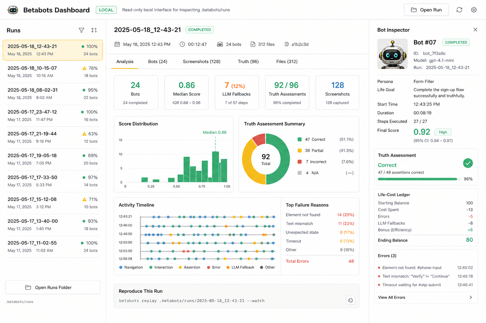

# Local Dashboard

Betabots includes a minimal local dashboard for reading `.betabots/runs` artifacts.

The dashboard is intentionally read-only. It does not run bots, edit cohorts, or mutate target projects. It is a local artifact browser for run summaries, raw bot logs, screenshots, truth assessments, and files.

## Start

From a project that contains `.betabots/runs`:

```bash
node /path/to/betabots/web/server.cjs
```

From the Betabots repository while inspecting another project:

```bash
node web/server.cjs \
  --runs /path/to/target-app/.betabots/runs \
  --port 3999
```

Open `http://127.0.0.1:3999`.

You can also set:

```bash
BETABOTS_RUNS_DIR=/path/to/.betabots/runs PORT=3999 node web/server.cjs
```

## Views

- `Runs`: recent run folders, status, bot count, timestamps.
- `Analysis`: rendered `analysis.md` as a readable console document.
- `Bots`: raw bot personas, scores, endings, and truth note counts.
- `Screenshots`: screenshot gallery from `screenshots/<bot-id>`.
- `Truth`: recorded `Truth assessment:` lines from raw logs.
- `Files`: direct links to run artifacts.
- `Inspector`: selected run or selected bot details, including life goal and life-cost decisions.

## Design



The first version follows the Stitch-generated Lab Console direction:

- off-white surfaces;
- graphite text and 1px technical borders;
- safety-yellow active states;
- teal LED status dots;
- dense three-pane layout;
- tiny robot accent only in the dashboard mark.

Stitch project: `8699747739188585304`.

The dashboard should remain a supporting devtool. Betabots itself stays CLI/script/agent-first.
